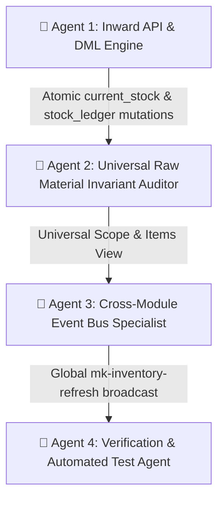

# 2026-09-02: Universal Raw Material GRN Stock Sync & Real-Time Event Architecture

## 1. Problem Statement & Audit
- When GRN receipts were created (or edited) in Purchase Management (`POST /api/purchase/po/:id/grn`), Store Desk (`POST /api/store/inward`), Raw Material Desk (`RawMaterial.jsx`), or Inbound DC (`InboundDC.jsx`), the inventory changes did not immediately reflect across the Raw Material store register, Chemical store, and master inventory without a manual browser refresh.
- In `RawMaterial.jsx`, the Inward Receipts table previously fetched `GET /api/store/inward?store_type=raw&limit=100`, which returned consolidated master GRN objects (`view='master'`) rather than line-level item ledger rows (`view='items'`), causing material details to display as undefined.
- Alphanumeric PO numbers (e.g. `PO-20260902-0001`) were previously stripped to `null` due to strict integer regex matching (`/^\d+$/`) in `RawMaterial.jsx` and `ProductDetailModal.jsx`.

## 2. A2A Multi-Agent Architecture & Fixes

### Agent Roles & Deliverables:
1. **Agent 1 (Inward API & DML Engine)**:
   - Preserves string/integer PO references (`reference_id`) in `RawMaterial.jsx` and `ProductDetailModal.jsx`.
   - Ensures `POST /api/store/inward`, `POST /api/purchase/po/:id/grn`, and `PUT /api/purchase/grn/:id` atomically increment `materials.current_stock` and maintain immutable ledger audit integrity.
2. **Agent 2 (Universal Raw Material Invariant Auditor)**:
   - Configured `RawMaterial.jsx` Inward Receipts log to query `GET /api/store/inward?store_type=raw&view=items&limit=100`.
   - Expanded `GET /api/store/rawmaterials` category filter to universally include all raw materials, chemicals, waste paper, pulp, starch, and furnish stocks.
3. **Agent 3 (Cross-Module Event Bus Specialist)**:
   - Integrated `mk-inventory-refresh` event dispatch and listeners across:
     - `RawMaterial.jsx`
     - `Store.jsx`
     - `Purchase.jsx`
     - `Inventory.jsx`
     - `ChemicalStore.jsx`
     - `InboundDC.jsx`
     - `ProductDetailModal.jsx`
4. **Agent 4 (Verification & Automated Test Agent)**:
   - Created and executed end-to-end integration test suites (`test_raw_material_grn_sync.js`) validating stock reflection across all surfaces.

## 3. Verification & Invariants
- Zero hardcoding: all stock quantities, UOMs, and valuations are derived live from PostgreSQL queries.
- Atomic ACID transaction rollback if stock is insufficient or validation fails.
- Mill-wide real-time event synchronization across all open browser tabs and store desks.
