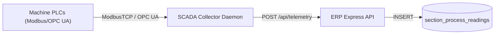

# SCADA, Boiler & Energy Fulfillment (Ph25)
# Stack: Node.js/Express + PostgreSQL + SCADA Collector Simulator
# Last updated: 2026-07-06

This document details the architecture, formulas, and schema expansions for the advanced telemetry fulfillment (SCADA Collector Daemon, Boiler Efficiency Log, and Section Energy sub-metering).

---

## 1. Boiler thermal efficiency calculations

Boiler efficiency is calculated using the **Direct Method**:

\[
\eta = \frac{Q_{steam} \times (h_g - h_f)}{Q_{fuel} \times GCV_{fuel}} \times 100
```

Where:
- \(Q_{steam}\): Hourly steam generated (kg/hr)
- \(h_g\): Enthalpy of saturated steam at operating pressure (kcal/kg) (derived from steam tables: ~660 kcal/kg at 10 bar)
- \(h_f\): Enthalpy of feed water (kcal/kg) (\(\approx\) feed water temp in °C)
- \(Q_{fuel}\): Hourly husk fuel consumed (kg/hr)
- \(GCV_{fuel}\): Gross Calorific Value of rice husk (kcal/kg) (~3,200 kcal/kg)

### Database Schema (`boiler_performance_logs`)
Stores hourly boiler logs:
```sql
CREATE TABLE IF NOT EXISTS boiler_performance_logs (
  id                  SERIAL PRIMARY KEY,
  log_time            TIMESTAMPTZ NOT NULL,
  steam_flow_kgh      NUMERIC(10,2) NOT NULL, -- Steam generated kg/hr
  steam_pressure_bar  NUMERIC(6,2) NOT NULL,  -- Bar
  feedwater_temp_c    NUMERIC(5,2) NOT NULL,  -- °C
  flue_gas_temp_c     NUMERIC(5,2),           -- °C (efficiency loss indicator)
  husk_consumed_kg    NUMERIC(10,2) NOT NULL, -- Husk weight
  blowdown_rate_pct   NUMERIC(4,2) DEFAULT 0, -- Blowdown %
  efficiency_pct      NUMERIC(5,2),           -- Computed efficiency
  logged_by           INTEGER REFERENCES users(id),
  created_at          TIMESTAMPTZ DEFAULT NOW()
);
```

---

## 2. Section energy sub-metering

Captures electrical energy (kWh) and steam energy (MT) consumption at section level.

### Database Schema (`section_energy_allocations`)
Allocates daily energy parameters to sections:
```sql
CREATE TABLE IF NOT EXISTS section_energy_allocations (
  id                  SERIAL PRIMARY KEY,
  allocated_date      DATE NOT NULL,
  section_id          INTEGER REFERENCES sections(id),
  power_kwh           NUMERIC(12,2) DEFAULT 0,
  steam_mt            NUMERIC(10,2) DEFAULT 0,
  water_kl            NUMERIC(10,2) DEFAULT 0,
  created_at          TIMESTAMPTZ DEFAULT NOW(),
  UNIQUE(allocated_date, section_id)
);
```

---

## 3. SCADA / PLC Telemetry Collector Daemon

To bridge shop-floor Modbus/OPC UA data into `section_process_readings`, we run a background daemon script (`scripts/scada_collector_daemon.js`).

### Data Flow



### Mock SCADA Tags
The daemon polls every 15 seconds:
- `PM1_WIRE_VAC_P1` (Wire Vacuum level)
- `PM1_PRESS_NIP_LOAD` (Press Nip Load)
- `PM1_DRYER_STEAM_PRES` (Dryer Steam pressure)
